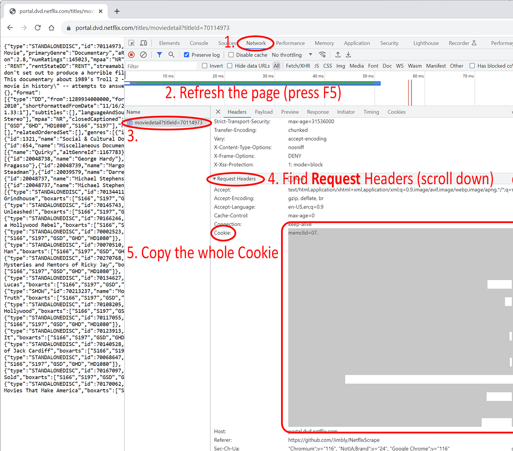
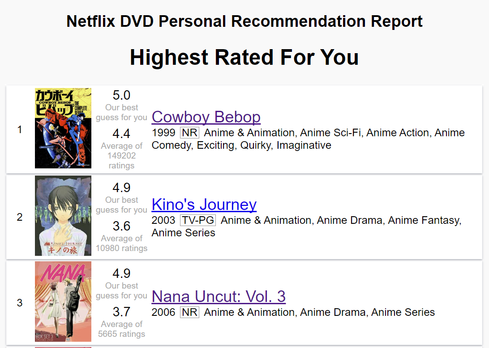

# Netflix DVD Data Extraction Tool

Downloads all of the raw prediction data for every movie in the Netflix database and generates a short report for the potentially most interesting to you.

Example output report [here](https://jimbly.github.io/NetflixScrape/examples/report.html).

# Instructions for use:
1. Download this tool
   1. Option 1 (Easiest, Windows only): Download [NexflixScrape.zip](https://jimbly.github.io/NetflixScrape/NetflixScrape.zip) portable bundle of everything needed
   2. Option 2 (from source): Download [NexflixScrapeSrcOnly.zip](https://jimbly.github.io/NetflixScrape/NetflixScrapeSrcOnly.zip) (or clone from GitHub), install Node.js
2. *Extract* the Zip file (on Windows: right click, choose `Extract All...`, do not just double-click and try to run from within the .zip file)

     2b. If you installed from source (Option 2 above), open a command/terminal/shell window in the newly extracted folder, and run `npm install`
4. Use the Chrome developer tools (or similar tools in another browser) to copy the `Cookie` string from an authenticated request to `dvd.netflix.com`
    1. This is equivalent to your PASSWORD to Netflix, do not share it with anyone!
    2. It may start with something like "memclid=01234-56789-" or "DVistor="
    3. To find it (see image below):
        1. Open a Chrome window, sign in to Netflix
        2. Go to https://portal.dvd.netflix.com/titles/moviedetail?titleId=70114973
        3. It should show you a JSON blob starting with `{"type":"STANDALONEDISC"` if everything is working correctly
        4. Then, press F12 to open the developer tools, and navigate to the Network tab
        5. Refresh the page (F5), then click on the one entry (should be `moviedetails`)
        6. Under "Request Headers" (NOT "Response Headers"), find the "Cookie" section
        7. Select the entire thing and copy to your clipboard.  It should be quite large / many lines
5. In the extracted NetflixScrape folder, open `headers.js` in your favorite text editor (Notepad will work just fine, just right click, choose Edit)
6. Paste the Cookie you copied in step 3 above into this file into the indicated location, replacing the example text
7. You're ready to go!  Simply run `run.cmd` by double-clicking on it (Windows), or run `node .` on other platforms.
8. You can also edit `index.js` and configure some options at the top of the file to control the output and filtering options.

# Extra help finding your Cookie string

# Notes
* This tool will download data on around 53K movies/shows from the Netflix DVD site, including, most importantly, their personal prediction for you
* This tool is rate-limited to download at most 2 movies per second, so that you don't run into any rate-limiting on the Netflix side, and don't cause problems for the Netflix site and other users.  It will take about 7.5 hours to finish.  You can freely stop it at any time and it will pick up where it left off.
* While developing and running this, I noticed my Netflix predicted ratings scores changing (sometimes significantly), so it is likely that either Netflix uses which pages you view to feed the ratings engine (and this tool effectively views th pages of every single movie) or there is a lot of noise in their prediction algorithm.
* Once it's finished downloading the data for all movies, it takes only a couple seconds to run to generate a report.
* All of the raw data is in JSON files in the data/movies folder.  Use this to look up recommendations for any of these 53k movies and shows at any time in the future!

# Example Output

